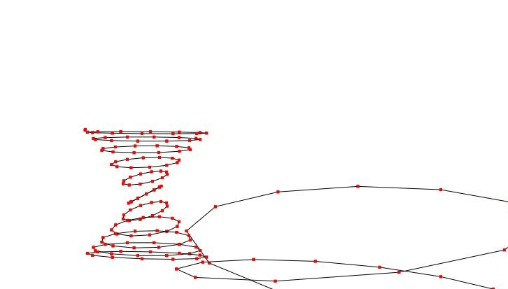

### 3D Projections

- [Code Repository](https://github.com/josephheimel/cg-3dprojections)

In this project, my group mate and I were tasked with rendering a wireframe of various 3D objects to the screen. We started with a matrix defining each object in isolated space and needed to use other matrices (view, model, projection) in order to properly render it.

The image is of a couple of strange objects we found while trying to model a sphere.

