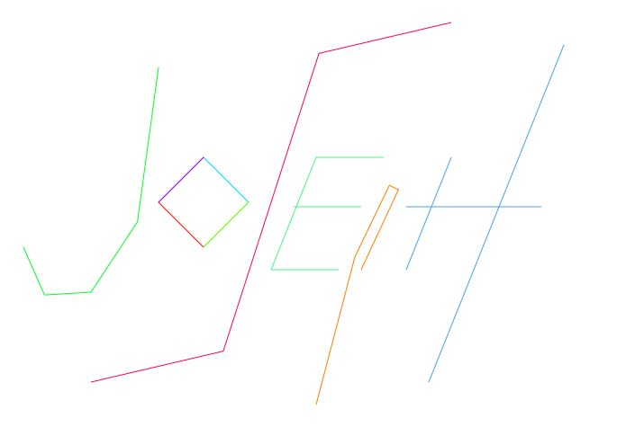

### Shapes and Curves

- [Code Repository](https://github.com/josephheimel/shapescurves)

This project involved rendering shapes and curves of a 2D image based on individual points. Curves were comprised of a series of straight lines that were determined by an interpolation algorithm. Additionally I chose to change the color of a curve depending on how many line segments are drawn.

The pictures show my name with the minimum and maximum number of line segments.

